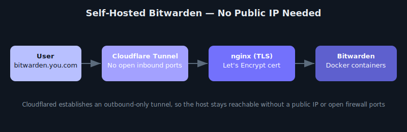

# 🛠️ Bitwarden Self-Hosting via Docker + Cloudflare Tunnel (Step-by-Step Guide)

  

This guide outlines the exact steps taken to install and expose a **self-hosted Bitwarden instance** on Ubuntu using **Docker** and **Cloudflare Tunnel**, without needing a public IP.



---

## 🔧 System Environment

- OS: Ubuntu 24.04
- User: `bitwarden`
- Domain: `bitwarden.your-domain.com`
- Deployment: Docker containers
- Exposure: Cloudflare Tunnel

---

## ✅ Step 1: Install Docker & Docker Compose

```bash
sudo apt update
sudo apt install -y docker.io docker-compose
sudo usermod -aG docker $USER
newgrp docker
```

---

## ✅ Step 2: Install Bitwarden (Self-Hosted)

```bash
curl -Lso bitwarden.sh https://go.btwrdn.co/bw-sh   && chmod +x bitwarden.sh   && ./bitwarden.sh install
```

During setup:
- Set domain: `bitwarden.your-domain.com`
- Choose Let's Encrypt: Yes
- Install completes and generates containers

---

## ✅ Step 3: Generate Let's Encrypt SSL Cert

Certbot standalone challenge failed due to CG-NAT, so used DNS challenge:

```bash
sudo apt install certbot
sudo certbot certonly --manual --preferred-challenges dns -d bitwarden.your-domain.com
```

Follow prompts to set a TXT record at your DNS provider.

---

## ✅ Step 4: Copy SSL Files

```bash
sudo mkdir -p /etc/ssl/bitwarden.your-domain.com
sudo cp /etc/letsencrypt/live/bitwarden.your-domain.com/fullchain.pem /etc/ssl/bitwarden.your-domain.com/certificate.crt
sudo cp /etc/letsencrypt/live/bitwarden.your-domain.com/privkey.pem /etc/ssl/bitwarden.your-domain.com/private.key
sudo cp /etc/letsencrypt/live/bitwarden.your-domain.com/fullchain.pem /etc/ssl/bitwarden.your-domain.com/ca.crt
sudo chmod 644 /etc/ssl/bitwarden.your-domain.com/*
```

---

## ✅ Step 5: Configure Bitwarden to Use SSL

Edit `~/bwdata/env/global.override.env`:

```ini
globalSettings__ssl__enabled=true
globalSettings__ssl__certificatePath=/etc/ssl/bitwarden.your-domain.com/certificate.crt
globalSettings__ssl__certificateKeyPath=/etc/ssl/bitwarden.your-domain.com/private.key
```

---

## ✅ Step 6: Mount SSL Files via Docker Override

Create or edit `~/bwdata/docker/docker-compose.override.yml`:

```yaml
version: "3.7"
services:
  nginx:
    volumes:
      - /etc/ssl/bitwarden.your-domain.com:/etc/ssl/bitwarden.your-domain.com:ro
```

---

## ✅ Step 7: Rebuild and Start Bitwarden

```bash
cd ~/bwdata/..
./bitwarden.sh rebuild
./bitwarden.sh start
```

---

## ✅ Step 8: Install Cloudflared (Tunnel)

```bash
wget https://github.com/cloudflare/cloudflared/releases/latest/download/cloudflared-linux-amd64.deb
sudo dpkg -i cloudflared-linux-amd64.deb
```

---

## ✅ Step 9: Set Up Cloudflare Tunnel

1. **Login:**

```bash
cloudflared tunnel login
```

2. **Create tunnel:**

```bash
cloudflared tunnel create bitwarden-tunnel
```

3. **Route DNS:**

```bash
cloudflared tunnel route dns bitwarden-tunnel bitwarden.your-domain.com
```

---

## ✅ Step 10: Configure and Run the Tunnel

Create `/etc/cloudflared/config.yml`:

```yaml
tunnel: bitwarden-tunnel
credentials-file: /home/bitwarden/.cloudflared/<UUID>.json

ingress:
  - hostname: bitwarden.your-domain.com
    service: https://172.18.0.X:8443
    originRequest:
      noTLSVerify: true
  - service: http_status:404
```

> Replace `172.18.0.X` with the container's actual IP (use `docker inspect bitwarden-nginx`)

4. **Run the tunnel:**

```bash
cloudflared tunnel run bitwarden-tunnel
```

---

## ✅ Step 11: Access Bitwarden

Visit:
```
https://bitwarden.your-domain.com
```

Create an account and log in.

---

## ✅ (Optional) Enable Admin Portal

Add to `global.override.env`:

```ini
adminSettings__admins=you@example.com
```

Rebuild:

```bash
./bitwarden.sh rebuild && ./bitwarden.sh start
```

Access admin portal:
```
https://bitwarden.your-domain.com/admin
```

---

## ✅ Done!

You now have a fully encrypted, self-hosted Bitwarden instance accessible from anywhere — without needing a public IP.

---

## 📄 License

This guide is licensed under the MIT License. See [LICENSE](./MIT%20License.txt) for details.